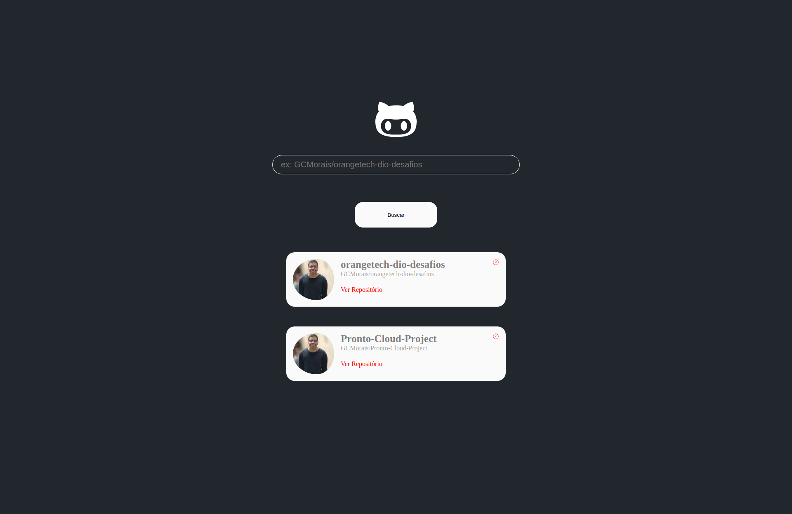

# Github - Wiki 🚀 DIO Orangetech +

Este repositório é para o desafio do Bootcamp OrangeTech+ proposto pela [DIO](https://www.rocketseat.com.br/) em parceria com o Banco Inter.

## Preview

## Tecnologias

    - React
    - Styled-Components
    - Axios
    - GIT & GITHUB
    - Node e NPM

## Feedback

Se você tiver algum feedback, por favor me envie nos contatos que estarei disponibilizando no tópico abaixo, conto com sua ajuda :D

## Redes Sociais / Contato

- Linkedin [@guilhermecmorais](https://www.linkedin.com/in/guilhermecmorais/)
- Email guilhermeclarodemorais@gmail.com