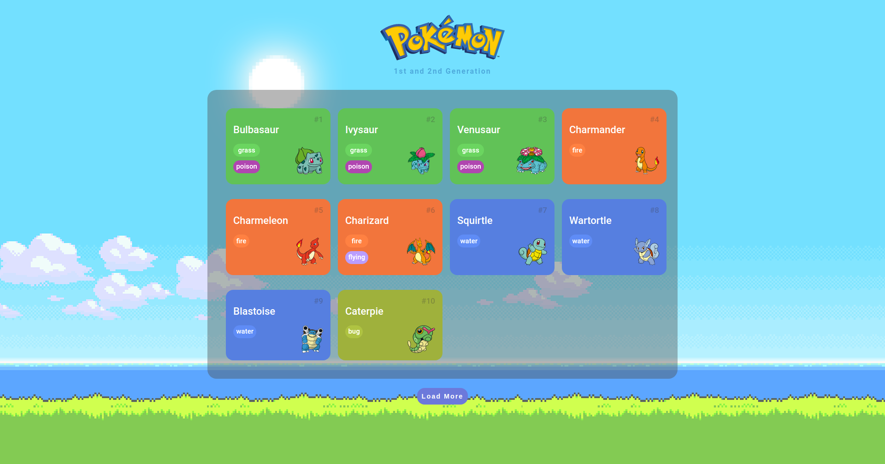

<h1 align="center"> 🕹 Pokédex    </h1>

Esse projeto faz parte do Bootcamp OrangeTech+ proposto pela DIO em parceria com o Banco Inter

  <a href="#-tecnologias">Projeto</a>&nbsp;&nbsp;&nbsp;|&nbsp;&nbsp;&nbsp;
  <a href="#-projeto">Tecnologias</a>&nbsp;&nbsp;&nbsp;|&nbsp;&nbsp;&nbsp;
  <a href="#-layout">Feedback</a>&nbsp;&nbsp;&nbsp;|&nbsp;&nbsp;&nbsp;
  <a href="#memo-licença">Contato</a>

 

 

## 🔝 Preview

## 💻 Projeto

A ideia do projeto é construir uma Pokédex, uma enciclopédia digital onde fornece informações sobre todos os pokémons do mundo fictício.

## 👨‍💻 Tecnologias

    - HTML & CSS
    - Javascript
    - GIT & GITHUB
    - Node e NPM
    - Requisições em API (PokéAPI)
    - Vite

## 🚀 Feedback

Se você tiver algum feedback, por favor me envie nos contatos que estarei disponibilizando no tópico abaixo, conto com sua ajuda !!!

## 📍 Redes Sociais / Contato

- Linkedin [@guilhermecmorais](https://www.linkedin.com/in/guilhermecmorais/)
- Email guilhermeclarodemorais@gmail.com
