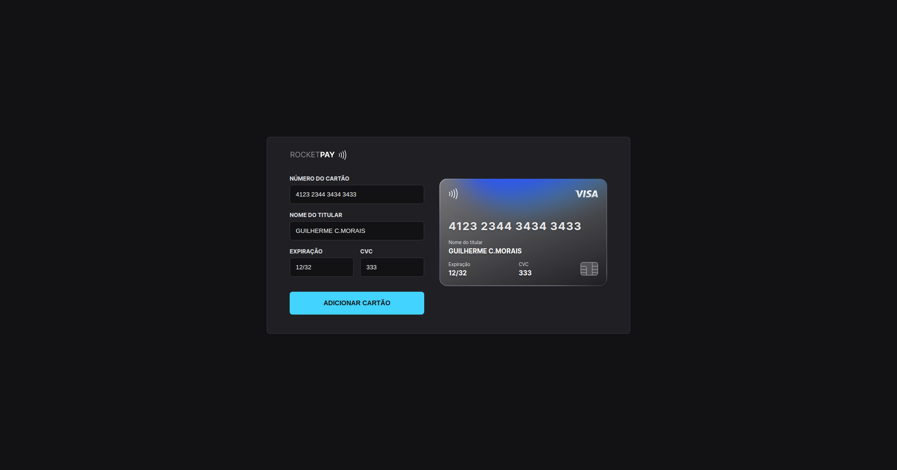

<h1 align="center"> Explorer Lab - Rocket Pay - ReactJS </h1>

Evento exclusivo e gratuito, promovido pela Rocketseat para ensino de tecnologias WEB.

  <a href="#-tecnologias">Projeto</a>&nbsp;&nbsp;&nbsp;|&nbsp;&nbsp;&nbsp;
  <a href="#-projeto">Tecnologias</a>&nbsp;&nbsp;&nbsp;|&nbsp;&nbsp;&nbsp;
  <a href="#-layout">Feedback</a>&nbsp;&nbsp;&nbsp;|&nbsp;&nbsp;&nbsp;
  <a href="#memo-licença">Contato</a>

 

  

## 💻 Projeto

O Rocketpay é um componente que simula o formulário de preenchimento de cartão de crédito, onde é possível adicionar máscara aos inputs e atualizar elementos HTML via DOM.

## Tecnologias

    - HTML & CSS
    - Javascript & JSON
    - GIT & GITHUB
    - Node e NPM
    - Vite
    - iMask

## Feedback

Se você tiver algum feedback, por favor me envie nos contatos que estarei disponibilizando no tópico abaixo, conto com sua ajuda !!!

## Redes Sociais / Contato

- Linkedin [@guilhermecmorais](https://www.linkedin.com/in/guilhermecmorais/)
- Email guilhermeclarodemorais@gmail.com
